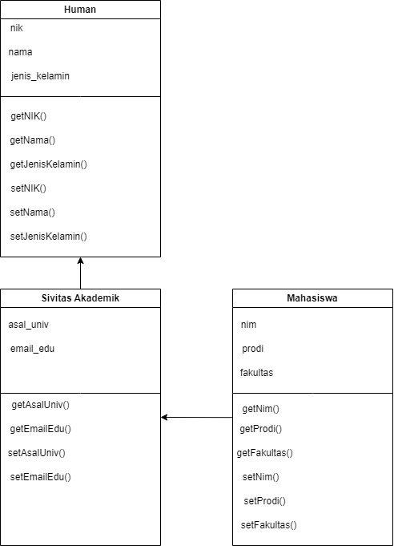
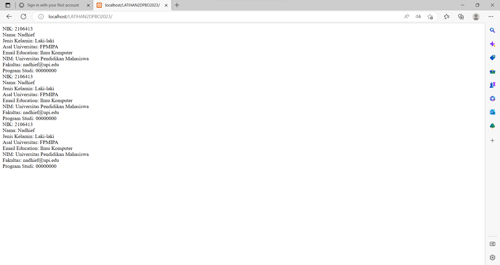

## Janji
Saya Nadhief Athallah Isya NIM 2106413 mengerjakan soal Latihan 2
dalam mata kuliah Desain Pemrograman Berorientasi Objek untuk keberkahanNya
maka saya tidak melakukan kecurangan seperti yang telah dispesifikasikan.
Aamiin.

# Tugas LATIHAN1DPBO2023
Buatlah program berbasis OOP menggunakan bahasa pemrograman C++, Java, Python, dan PHP yang mengimplementasikan konsep Multi-level Inheritance  pada kelas - kelas tersebut:
Mahasiswa: NIM, nama, jenis_kelamin, fakultas, prodi
Human: NIK, nama, jenis_kelamin
SivitasAkademik: asal_universitas, email_edu
Note.
Boleh menambahkan properti/atribut baru
Tampilkan data selengkap-lengkapnya dalam bentuk list/tabel
Program dikumpulkan pada repository GitHub yang dibuat public dengan nama “LATIHAN2DPBO2023”
Hanya program pada branch Main yang akan dinilai dan diperiksa
Jika waktu pengumpulan sudah habis dan ingin mengupdate kode program, update pada branch lain karena mengupdate branch Main setelah waktu pengumpulan terlewat maka program tidak akan dinilai
Struktur folder
- CPP
   - program
   - screenshot
+ Java
+ Python
+ PHP
README.md
File README berisi desain program, penjelasan alur, dan dokumentasi saat program dijalankan (screenshot/screen record, pilih salah satu bahasa sebagai contoh)
Submit link repository pada form berikut: https://forms.gle/rvb1hKxbQVuYNbhKA 
## Desain Program java

Desain yang saya buat menggunakan 1 Class:
* Human.java

-> Class Human memiliki 3 atribut utama :
* **nik**
* **nama**
* **jenis_kelamin**

-> Class Human memiliki 1 anak 
* **sivitas akademik**
* sivitas akademik merupakan sekumpulan orang yang bergelut dibidang akademik. makannya sivitas bisa jadi anak nya Human karena objek mereka sama sama orang bukan pisang.  

-> Class sivitas akademik memiliki 1 anak dan 2 atribut utama yaitu asal_universtias dan email_edu
* **mahasiswa**
* otomatis mahasiswa pun termasuk dalam sivitas akademik makannya mahasiswa bisa jadi anaknya sivitas akademik

-> class mahasiswa punya 3 atribut utama yaitu NIM, fakultas, dan prodi

di class mahasiswa kenapa konstruktor parameternya ada banyak soalnya dia butuh akses atribut dari class lain makannya atribut tiap class di set nya protected biar bisa di akses

## Alur Program
    disemua bahasa memasukan inputan secara hardcode jadi tidak ada minta masukan dari program
## Dokumentasi Program

